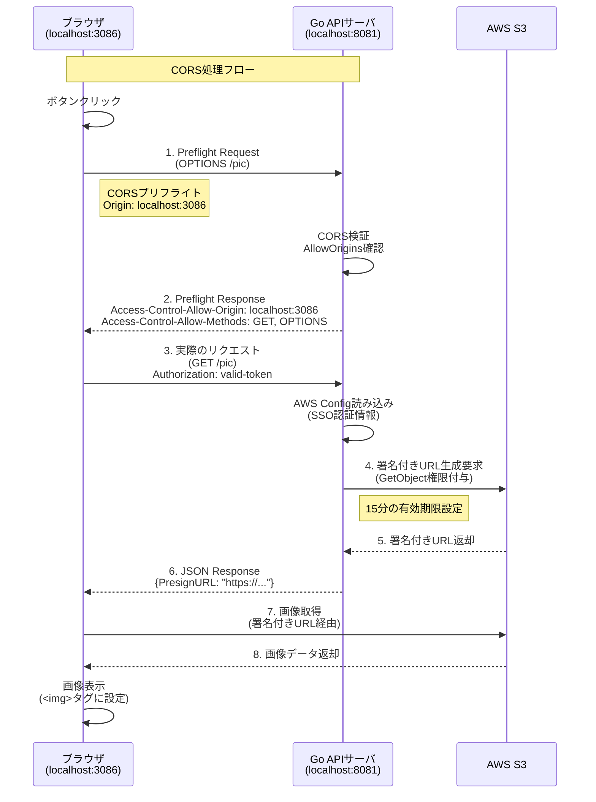

## 1.記事を書いた背景

私はインフラ側の経験が主ですが、開発チームから依頼されてS3のCORS許可ポリシーを設定することが何度かありました。
ただ、その度に調べて何となく理解し直すということを繰り返していてインフラ視点での理解に留まっていて少しモヤのある状態でした。
（実際にアプリ側の実装を行い、いくつかの実装パターンがあるという点も把握しないと感覚的な理解が得にくい設定だと思います。）

今回、GoのAPI開発を通してアプリケーション側でCORSを実装したことでより深く理解できたので、自分の知識を整理する目的で本記事をまとめています。

## 2.対象読者
- CORSの概念や設定についてふわっと理解しているが、実装レベルでの理解を深めたい方(自分みたいな)
- フロント,バックの実装レベルで処理を追いたい方(自分みたいなインフラ出身の方とか)

## 3.本記事について
### 3-1.書くこと
- GoにおけるCORSの実装を行います。
最終的にフロントエンドからCORSのリクエストが許可、拒否されていることを確認していきたいと思います。

### 3-2.書かないこと
- CORSの詳細については既に分かりやすい記事はありますので、以下あたりを参照ください。
https://qiita.com/Hirohana/items/9b5501c561954ad32be7

## 4.実装

### 4-1.AWSの認証情報について
- 今回はローカルの都合上、`.aws/configure`配下にAWS SSO経由で一時的なAdmin権限を取得しています。

### 4-2.実装パターンについて
- 今回はS3に格納している画像ファイルをGoのAPI側でCORSの認可を行い、バックエンド-S3間で発行した署名付きURLをフロントに返します。  
フロントのHTMLから直接署名付きURLを叩いて画像ファイルを取得して表示します。

- 実際のアプリケーションだと認可処理を`CloudFront`,`Lambda@Edge`を用いて行うのが一般的にベターなのかなと思います。
今回はCORSの処理の流れを追うことを焦点にしているためその辺りのインフラの実装は極力触りませんでした。
自分含めCORSについてあやふやになりそうな場合に見返そうと思います。

### 4-3.シーケンス図
- バックエンドAPIでCORS制御を行い、S3の署名付きURLを発行しています。署名付きURLを使用することで、S3バケット側でCORSポリシーを設定する必要がありません。




### 4-4.フロントエンド(TypeScript + React)
- ボタンを押下するとAPIサーバをフェッチして最終的に署名付きURLで直接S3から画像データを取得、表示しています。

- 今回は検証目的のため、Authorization ヘッダーには固定値を設定していますが、本番環境では適切な認証トークンを使用してください。
```tsx:./components/cors.tsx
import { useState } from "react";

export const CorsTest = () => {
  const [imageS3, setImageS3] = useState<string>("");
  const [error, setError] = useState<string>("");

  const API_DOMAIN = "http://localhost:8081";
  const API_PATH = "pic"

  const getS3 = async () => {
    try {
      setError("");
      const response = await fetch(`${API_DOMAIN}/${API_PATH}`, {
        method: "GET",
				// この記事では認証処理は省略しています。
        headers: { "Authorization": "valid-token" },
      });

      if (!response.ok) {
        setError(`GET Error: HTTP ${response.status} ${response.statusText}`);
        return;
      }
      
      const data = await response.json();
      console.log("data",data)
      setImageS3(data.PresignURL);
    } catch (err) {
      if (err instanceof TypeError && err.message === 'Failed to fetch') {
        setError(`GET Error: CORS error or network error. Check browser console for details.`);
      } else {
        setError(`GET Error: ${err instanceof Error ? err.message : String(err)}`);
      }
      console.error('Detailed error:', err);
    }
  };

	// imgタグに署名付きURLをステートで設定しボタンがクリックされたタイミングでGETを実行し表示する。
  return (
    <div style={{ padding: "20px" }}>
      <h2>CORS Middleware Test</h2>
      <h3>GET /{API_PATH}</h3>
      <button onClick={getS3}>GET S3 Image</button>
      
      {imageS3 && (
        <div style={{ marginBottom: "20px" }}> 
        
      </div>
      )}

      {error && (
        <div style={{ color: "red" }}>
          <h3>Error:</h3>
          <pre>{error}</pre>
        </div>
      )}
    </div>
  );
};

```

```tsx:./App.tsx
import { CorsTest } from "@/components/cors";

function App() {

  return (
    <>
      <CorsTest />
    </>
  );
}

export default App;

```

### バックエンド
- API側でCORS制御を行い、問題なければS3の署名付きURLの発行を行なっています。

```go:./routes/s3.go
package routes

import (
	"context"
	"github.com/aws/aws-sdk-go-v2/aws"
	"github.com/aws/aws-sdk-go-v2/config"
	"github.com/aws/aws-sdk-go-v2/service/s3"
	"github.com/gin-gonic/gin"
	"github.com/takehiro1111/gin-api/tasks/task12-cors/constants"
	"net/http"
	"time"
)

// 定数で定義している箇所はよしなに変更してください。
func GetS3FIle(c *gin.Context) {
	// S3との処理が10秒以上かかる場合はtimeoutするよう設定。
	ctx, cancel := context.WithTimeout(context.Background(), 10*time.Second)
	defer cancel()

	cfg, err := config.LoadDefaultConfig(
		ctx,
		// constants.DIとしているが、ローカル環境に応じた設定を行う。
		config.WithSharedConfigProfile(constants.DI),
		config.WithRegion("ap-northeast-1"),
	)
	if err != nil {
		c.JSON(http.StatusInternalServerError, gin.H{
			"error": "failed get aws configure",
		})
		return
	}

	s3Client := s3.NewFromConfig(cfg)

	input := &s3.GetObjectInput{
		Bucket: aws.String(constants.S3BucketName),
		Key:    aws.String(constants.S3KeyName),
	}

	s3PresignClient := s3.NewPresignClient(s3Client)

	presignedReq, err := s3PresignClient.PresignGetObject(ctx, input,
		func(opts *s3.PresignOptions) {
			// セキュリティ上の要件に応じて発行した署名付きURLに15分の時間制限をつける。
			opts.Expires = 15 * time.Minute
		})

	if err != nil {
		c.JSON(http.StatusInternalServerError, gin.H{
			"error": err.Error(),
		})
		return
	}

	// フロント側ではPresignURLの値を取得する。
	c.JSON(http.StatusOK, gin.H{
		"PresignURL": presignedReq.URL,
		"header":     presignedReq.SignedHeader,
	})
}

```

```go:main.go

package main

import (
	"github.com/gin-contrib/cors"
	"github.com/gin-gonic/gin"
	// packageのパスは各ローカル環境に応じて設定が必要。
	m "github.com/takehiro1111/gin-api/tasks/internal/middleware"
	r "github.com/takehiro1111/gin-api/tasks/task12-cors/routes"
	"os"
	"time"
)

func main() {
	router := gin.Default()

	loggerConfig := m.NewLoggerConfig(
		"info",
		"text",
		m.WithTimeFunc(time.Now),
		m.WithWriter(os.Stdout),
		m.WithEnableRequestBody(true),
	)
	router.Use(m.LoggerMiddleware(loggerConfig))

	// 今回はフロント側の処理を行うサーバ(localhost:3086)のみ許可する
	router.Use(cors.New(cors.Config{
		// フロント側は3086でローカルにサーバを立ててます。
		AllowOrigins:     []string{"http://localhost:3086"},
		AllowMethods:     []string{"GET", "OPTIONS"},
		AllowHeaders:     []string{"Origin", "Content-Type", "Authorization"},
		ExposeHeaders:    []string{"Content-Length"},
		AllowCredentials: true,
		MaxAge:           12 * time.Hour,
	}))

	// フロント側でlocalhost:8081/picを叩くと署名付きURLをS3から取得してフロントへ返す処理が走る。
	router.GET("/pic", r.GetS3FIle)

	router.Run(":8081")
}

```

## 確認
- ボタンをクリックしたらS3に格納した画像(今回はS3のロゴ)の確認ができました。


## 参考
https://pkg.go.dev/github.com/aws/aws-sdk-go-v2
https://github.com/gin-contrib/cors
https://pkg.go.dev/github.com/gin-contrib/cors
https://documentroot.org/articles/get-object-from-aws-s3-in-go.html
