## 1.記事を書いた背景

WebSocket の実装が初めてだったこともあり、頭の中を整理しておこうと思い記事にしました。
全然関係ないですが、1 年くらい前にプロダクトへサーバレス構成でチャット機能を実装する時にインフラ側の基盤を作ったのが懐かしく感じました。

## 2.対象読者

- WebSocket って聞いたことあるけど何だっけという方(自分みたいな)
- 実装レベルで気になる方(自分みたいな)

## 3.WebSocket とは？

> WebSocket API は、ユーザーのブラウザーとサーバー間で対話的な通信セッションを開くことができるものです。この API を使用すると、サーバーにメッセージを送信し、サーバーから返信をポーリングすることなく応答を受信することができます。

例えばチャットをイメージすればわかりやすいと思います。
同じサーバーに対して複数のクライアントが同じメッセージを即座に共有できますよね。
あれを実現するためのプロトコルです。
最初は`HTTP`でハンドシェイクを行い、その後に双方向通信が可能な WebSocket プロトコル（`ws://` or `wss://`）に切り替わります。
厳密に概念を理解したい場合は以下の記事を確認いただいた方が良いです。
@[card](https://developer.mozilla.org/ja/docs/Web/API/WebSockets_API)
@[card](https://www.tohoho-web.com/ex/websocket.html)
@[card](https://zenn.dev/nameless_sn/articles/websocket_tutorial)

## 4.WebSocket の 2 つの実装パターン

- 今回は Echo と Chat の 2 種類の実装について記述します。比較しやすいように最後にブラウザで処理を比較していきます。

### 4-1.Echo

- 1 対 1 の単純な通信モデルで送信したメッセージをそのまま送信元のクライアントに返す処理です。言葉そのままに`echo`コマンドのようなイメージです。

#### 主な特徴

- コネクションの管理が不要（各クライアントは独立）
- 状態管理がシンプル
- サーバー側の実装が最小限で済む
- デバッグやテストに最適

#### ユースケース

- WebSocket 接続のテスト・検証
- リアルタイム入力検証（入力値のバリデーションチェック）
- ネットワーク遅延の計測（Ping/Pong）
- WebSocket の学習・プロトタイピング

### 4-2.Chat

- 多対多の通信モデルで複数のクライアント間でメッセージを共有します。送信したメッセージは自身だけでなく他クライアントにも共有されます。

#### 主な特徴

- アクティブなコネクションの一覧管理が必要
- 同時接続数に応じたリソース管理
- メッセージのブロードキャスト処理
- より複雑なエラーハンドリング

#### ユースケース

- リアルタイムチャットアプリケーション
- 共同編集ツール（Google Docs のような機能）
- ライブダッシュボード（複数ユーザーへの同時更新）
- オンラインゲームのマルチプレイヤー機能
- リアルタイム通知システム

## 5.実装

- 上記で記述している Echo,Chat の簡易的な機能を実装します。

### 5-1.フロントエンド(TypeScript + React)

- フロントエンドの画面はほぼ共通のため、以下でインラインで実装を記述します。

:::details src/components/Websocket.tsx

```tsx
import { useState } from "react";
import useWebSocket from "@/hooks/useWebSocket";
import styles from "@/styles/websocket.module.css";

const API_CONF = {
  DOMAIN: "wss://localhost:8080",
  PATH: "/echo", // /wsに変更するとchatの処理に切り替わる
} as const;

export const WebSocketClient = () => {
  const { messages, sendMessage } = useWebSocket(
    `${API_CONF.DOMAIN}${API_CONF.PATH}`
  );
  const [input, setInput] = useState<string>("");

  return (
    <div className={styles.chatContainer}>
      <div className={styles.chatBox}>
        <h2 className={styles.chatTitle}>WebSocket GET {`${API_CONF.PATH}`}</h2>
        <div className={styles.inputArea}>
          <input
            className={styles.messageInput}
            value={input}
            onChange={(e) => setInput(e.target.value)}
            onKeyDown={(e) => {
              if (e.key === "Enter") {
                sendMessage(input);
                setInput("");
              }
            }}
            placeholder="メッセージを入力..."
          />
          <button
            className={styles.sendButton}
            onClick={() => {
              sendMessage(input);
              setInput("");
            }}
          >
            Send
          </button>
        </div>
        <div className={styles.messagesArea}>
          {messages.map((m, idx) => (
            <div key={idx} className={styles.message}>
              {m}
            </div>
          ))}
        </div>
      </div>
    </div>
  );
};
```

:::

:::details src/hooks/useWebsocket.tsx

```tsx
import { useState, useEffect } from "react";

const useWebSocket = (url: string) => {
  const [messages, setMessages] = useState<string[]>([]);
  const [ws, setWs] = useState<WebSocket | null>(null);

  useEffect(() => {
    const websocket = new WebSocket(url);
    websocket.onmessage = (e) => {
      setMessages((prev) => [...prev, e.data]);
    };
    setWs(websocket);
    return () => websocket.close();
  }, [url]);

  const sendMessage = (msg: string) => {
    ws?.send(msg);
  };

  return { messages, sendMessage };
};

export default useWebSocket;
```

:::

::: details src/styles/websocket.module.css

```css
.chatContainer {
  position: fixed;
  top: 0;
  left: 0;
  width: 100vw;
  height: 100vh;
  display: flex;
  justify-content: center;
  align-items: center;
  background-color: rgba(245, 245, 245, 0.9);
  z-index: 1000;
}

.chatBox {
  width: 500px;
  height: 600px;
  background: white;
  border-radius: 8px;
  box-shadow: 0 2px 10px rgba(0, 0, 0, 0.1);
  display: flex;
  flex-direction: column;
}

.chatTitle {
  padding: 16px;
  border-bottom: 1px solid #e0e0e0;
  margin: 0;
}

.messagesArea {
  flex: 1;
  overflow-y: auto;
  padding: 16px;
}

.message {
  padding: 8px;
  margin-bottom: 8px;
  background: #e3f2fd;
  border-radius: 4px;
}

.inputArea {
  display: flex;
  padding: 16px;
  border-top: 1px solid #e0e0e0;
  gap: 8px;
}

.messageInput {
  flex: 1;
  padding: 8px;
  border: 1px solid #ccc;
  border-radius: 4px;
}

.sendButton {
  padding: 8px 16px;
  background: #1976d2;
  color: white;
  border: none;
  border-radius: 4px;
  cursor: pointer;
}

.sendButton:hover {
  background: #1565c0;
}

```
:::

::: details src/App.tsx

```tsx
import { WebSocketClient } from "@/components/websocket";

function App() {
  return (
    <>
      <WebSocketClient />
    </>
  );
}

export default App;
```

:::

### 5-2.バックエンド(Go + Gin)

- main はそれぞれの route の指定と異なるオリジンを許可する CORS 制御,グレースフルシャットダウン等を実装しています。  
  ここも共通なのでインラインで記述します。

- 今回の実装ではDBの永続化は行なっていません。メモリでデータを持っています。

::: details ./main.go

```go
package main

import (
	"context"
	"crypto/tls"
	"flag"
	"fmt"
	"log"
	"net/http"
	"os"
	"os/signal"
	"time"

	"github.com/gin-contrib/cors"
	"github.com/gin-gonic/gin"
	r "github.com/takehiro1111/gin-api/tasks/task31-web-socket/routes"
)

func main() {
	router := gin.Default()

	// デフォルトは8080
	var port = flag.String("port", "8080", "server port")
	flag.Parse()

	timeProvider := r.NewRealTimeProvider()
	hub := r.NewHub(timeProvider)
	go hub.Run()

	router.GET("/ws", hub.ChatServer)
	
	router.GET("/echo", func(c *gin.Context) {
		r.EchoServer(c, timeProvider)
	})

	interrupt := make(chan os.Signal, 1)
	signal.Notify(interrupt, os.Interrupt)

	router.Use(cors.New(cors.Config{
		AllowOrigins: []string{"https://localhost:3086/app", "https://localhost:3087/app"},
		AllowMethods: []string{"GET", "POST", "OPTIONS"},
		AllowHeaders: []string{"Origin", "Content-Type", "Authorization", "X-CSRF-Token", "Cache-Control", "ETag"},

		ExposeHeaders:    []string{"Content-Type", "Authorization", "Cache-Control", "ETag"},
		AllowCredentials: true,
		MaxAge:           12 * time.Hour,
	}))

	srv := &http.Server{
		Addr:    fmt.Sprintf(":%s", *port),
		Handler: router,
		TLSConfig: &tls.Config{
			MinVersion: tls.VersionTLS12,
		},
	}

	done := make(chan struct{})
	go func() {
		// 秘密鍵を置いているパスを指定しているため、ローカル環境に合わせていただく必要がある。
		err := srv.ListenAndServeTLS("../task22-23-jwt-refresh/localhost.pem", "../task22-23-jwt-refresh/localhost-key.pem")
		if err != nil && err != http.ErrServerClosed {
			log.Fatal(err)
		}
		close(done)
	}()

	select {
	case <-interrupt:
		// Ctrl+Cを待つ
		log.Println("Shutting down server...")

		ctx, cancel := context.WithTimeout(context.Background(), 5*time.Second)
		defer cancel()

		// グレースフルシャットダウン
		err := srv.Shutdown(ctx)
		if err != nil {
			log.Fatal("Server forced to shutdown:", err)
		}
	case <-done:
		log.Println("Server stopped")
	}

	log.Println("Server exiting")
}

```

:::

### 5-2-1.Echo(1対1)

- echo の処理については、ping/pong も実装してクライアントサーバー間で適切に接続を維持する処理も入れています。

```mermaid
sequenceDiagram
	participant Client as クライアント(localhost:3086)
	participant Server as サーバー(localhost:8080)
	
	Client->>Server: WebSocket接続リクエスト (HTTP Upgrade)
	Server->>Client: 接続確立 (WebSocket)
	
	Note over Server: ReadDeadline設定<br/>Pongハンドラー登録
	
	par メッセージ送受信
			Client->>Server: メッセージ送信
			Server->>Server: メッセージ受信
			Server->>Client: 同じメッセージをエコーバック
	and Ping/Pong (接続監視)
			loop 54秒ごと
					Server->>Client: Ping送信
					Client->>Server: Pong応答
					Note over Server: ReadDeadline更新
			end
	end
	
	Note over Client: 接続終了
	Client->>Server: 切断通知
	Server->>Server: コネクションクローズ<br/>goroutine終了
```



- `Ping` → サーバーからクライアントへの問い合わせ
- `Pong` → クライアントからサーバーへの応答
```go:./routes/echo.go
package routes

import (
	"log"
	"time"

	"github.com/gin-gonic/gin"
	"github.com/gorilla/websocket"
	"net/http"
)

const (
	readTimeout = 60 * time.Second       // Pong(メッセージ/Pong受信のタイムアウト)
	pingPeriod  = (readTimeout * 9) / 10 // Ping間隔（54秒 = 60秒の90%）
	writeWait   = 10 * time.Second
)

// ユニットテストでモックを使用できるようinterfaceを用いて外部から注入している
type TimeProvider interface {
	Now() time.Time
}

type RealTimeProvider struct{}

func (r *RealTimeProvider) Now() time.Time {
	return time.Now()
}

func NewRealTimeProvider() *RealTimeProvider {
	return &RealTimeProvider{}
}

func EchoServer(c *gin.Context, timeProvider TimeProvider) {
	upgrader := websocket.Upgrader{
		ReadBufferSize:  1024,
		WriteBufferSize: 1024,
		CheckOrigin: func(r *http.Request) bool {
			return true // 開発環境用
		},
	}

	conn, err := upgrader.Upgrade(c.Writer, c.Request, nil)
	if err != nil {
		log.Printf("Failed to set websocket upgrade: %+v\n", err)
		return
	}

	// 初期接続時のReadDeadlineを設定
	conn.SetReadDeadline(timeProvider.Now().Add(readTimeout))

	conn.SetPongHandler(func(string) error {
		log.Println("pong received")
		conn.SetReadDeadline(timeProvider.Now().Add(readTimeout))
		return nil
	})

	done := make(chan struct{})

	go readAndEcho(conn, timeProvider, done)
	go sendPeriodicPing(conn, timeProvider, done)

	// チャネルがクローズされるまで待機
	<-done
}

func readAndEcho(conn *websocket.Conn, timeProvider TimeProvider, done chan struct{}) {
	defer conn.Close()
	defer close(done)
	for {
		mt, msg, err := conn.ReadMessage()
		if err != nil {
			log.Println("read err:", err)
			return
		}
		log.Printf("recv: %s", msg)
		// 受信したメッセージをそのまま送り返すechoを実行
		conn.SetWriteDeadline(timeProvider.Now().Add(writeWait))
		err = conn.WriteMessage(mt, msg)
		if err != nil {
			log.Println("echo write:", err)
			return
		}
		log.Printf("echo: %s", msg)
	}
}

func sendPeriodicPing(conn *websocket.Conn, timeProvider TimeProvider, done chan struct{}) {
	pingTicker := time.NewTicker(pingPeriod)
	defer func() {
		pingTicker.Stop()
		conn.Close()
	}()

	for {
		select {
		case <-done:
			return

		case <-pingTicker.C:
			conn.SetWriteDeadline(timeProvider.Now().Add(writeWait))
			err := conn.WriteMessage(websocket.PingMessage, nil)
			if err != nil {
				log.Println("write:", err)
				return
			}
			log.Println("ping sent")
		}
	}
}

```

### 5-2-2.チャット(N対N)

```mermaid
sequenceDiagram
	participant Client1 as クライアント1(localhost:3086)
	participant Client2 as クライアント2(localhost:3087)
	participant Server as サーバー(localhost:8080)
	
	Note over Server: Hub起動<br/>Run() goroutine開始
	
	Client1->>Server: WebSocket接続リクエスト
	Server->>Server: register チャネルへ送信
	Server->>Server: clientsマップに追加
	
	Client2->>Server: WebSocket接続リクエスト
	Server->>Server: register チャネルへ送信
	Server->>Server: clientsマップに追加
	
	Note over Server: 2つのクライアントが接続済み
	
	Client1->>Server: メッセージ送信 ("Hello")
	Server->>Server: broadcast チャネルへ送信
	Server->>Server: clientsマップを確認
	Server->>Client1: "Hello" 配信
	Server->>Client2: "Hello" 配信
	
	Client2->>Server: メッセージ送信 ("Hi")
	Server->>Server: broadcast チャネルへ送信
	Server->>Server: clientsマップを確認
	Server->>Client1: "Hi" 配信
	Server->>Client2: "Hi" 配信
	
	Note over Client1: 接続終了
	Client1->>Server: 切断通知
	Server->>Server: unregister チャネルへ送信
	Server->>Server: clientsマップから削除<br/>コネクションクローズ
```


:::message
**init 関数について**: パッケージ初期化時に `WriteMessages` を起動し、
broadcast チャネルからのメッセージ配信を常時監視します。
:::

```go:./routes/chat.go
package routes

import (
	"log"
	"net/http"
	"sync"

	"github.com/gin-gonic/gin"
	"github.com/gorilla/websocket"
)

type Message struct {
	Type    int
	Message []byte
}

// timeProviderは、echo.goで定義している構造体を使用
type Hub struct {
	clients   map[*websocket.Conn]bool
	broadcast chan Message
	register  chan *websocket.Conn
	unregister chan *websocket.Conn
	mu        sync.RWMutex
	timeProvider TimeProvider
}

func NewHub(timeProvider TimeProvider) *Hub {
	return &Hub{
		clients:    make(map[*websocket.Conn]bool),
		broadcast:  make(chan Message, 256), // バッファ付き
		register:   make(chan *websocket.Conn),
		unregister: make(chan *websocket.Conn),
		timeProvider: timeProvider,
	}
}

// Runをgoroutineとして常時起動させておくことで必要な場合に即座に処理される
func (h *Hub) Run() {
	for {
		select {
		// ユーザー登録するためにコネクションをclientsマップへ追加
		case conn := <-h.register:
			h.mu.Lock()
			h.clients[conn] = true
			h.mu.Unlock()
			
		// サーバーとの接続が切れたクライアントのデータを削除
		case conn := <-h.unregister:
			h.mu.Lock()
			if _, ok := h.clients[conn]; ok {
				delete(h.clients, conn)
				conn.Close()
			}
			h.mu.Unlock()
			
		// broadcastへメッセージデータが入ったら各クライアントへ通知する
		case message := <-h.broadcast:
			h.mu.Lock()
			for client := range h.clients {
				err := client.WriteMessage(message.Type, message.Message)
				if err != nil {
					log.Printf("error: %v", err)
					client.Close()
					delete(h.clients, client)
				}
			}
			h.mu.Unlock()
		}
	}
}

func (h *Hub) ChatServer(c *gin.Context) {
	upgrader := websocket.Upgrader{
		ReadBufferSize:  1024,
		WriteBufferSize: 1024,
		CheckOrigin: func(r *http.Request) bool {
			return true
		},
	}

	conn, err := upgrader.Upgrade(c.Writer, c.Request, nil)
	if err != nil {
		log.Printf("Failed to upgrade: %+v\n", err)
		return
	}

	h.register <- conn

	defer func() {
		h.unregister <- conn
	}()

	h.readAndBroadcast(conn)
}

func (h *Hub) readAndBroadcast(conn *websocket.Conn) {
	for {
		mt, msg, err := conn.ReadMessage()
		if err != nil {
			log.Printf("ReadMessage Error: %+v\n", err)
			break
		}
		h.broadcast <- Message{Type: mt, Message: msg}
	}
}

```

## 6.動作確認

### Echo サーバー

#### `wscat` での動作確認

```zsh
wscat -c wss://localhost:8080/echo --no-check
Connected (press CTRL+C to quit)
> test
< test
```

#### ブラウザ

- 自身のクライアントで送信したメッセージがサーバーを経由して自身に返ってきている
  

### Chat サーバー
- 各クライアントで送信したメッセージがサーバーを経由して、送信元を含む接続中の全クライアントに配信されている
- 異なるポート番号のクライアントでいずれかのクライアントから送信したメッセージが同時に表示される。
	- 左: https://localhost:3086/app
	- 右: https://localhost:3087/app 

  

## 参考

@[card](https://zenn.dev/portalkeyinc/articles/7256bb4e5b9575)
@[card](https://zenn.dev/show_yeah/articles/bece10823d182c)
@[card](https://github.com/gorilla/websocket/tree/main/examples)
@[card](https://pkg.go.dev/github.com/gorilla/websocket#section-readme)
