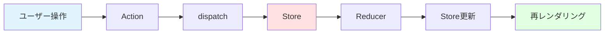

## 1.記事を書いた背景
初めてReduxを触っているのですが、独特で慣れが必要だなと感じたのでコンポーネントを整理するにあたり、形として残しておきたかったためです。
Reduxに不慣れな方のご参考にもなれば幸いです。

## 2.書くこと
- 各コンポーネントの説明
- APIをfetchしてデータ表示する処理のコード

## 3.Reduxとは？
> Reduxは、アプリケーション全体の状態を管理および更新するためのパターンとライブラリです。UIは「アクション」と呼ばれるイベントをトリガーして何が起こったかを伝え、それに応じて「リデューサー」と呼ばれる別の更新ロジックが状態を更新します。Reduxは、アプリケーション全体で使用する必要がある状態を一元的に保存する役割を果たし、状態が予測可能な方法でのみ更新されるようにルールが定められています。

素のReactで実装するとuseStateやuseContextなどを使用していましたが、Reduxという単一のライブラリで状態を管理することができます。
少し癖があるので、慣れるまでは難しく感じると思います。（まさに今の私）
状態管理が複雑なケースや中~大規模のアプリケーションで効果を発揮するようです。

## 4.Reduxの必要性
> 動作が一貫しており、さまざまな環境（クライアント、サーバー、ネイティブ）で実行でき、テストが容易なアプリケーションの作成に役立ちます。さらに、タイムトラベルデバッガーと組み合わせたライブコード編集など、優れた開発エクスペリエンスも提供します。

少し抽象的ですが、Reduxを使用することで規模が大きくなった場合に状態管理の実装方針やどこで管理されているのか慣習を統一することが出来そうかなという所感です。


@[card](https://redux.js.org/introduction/getting-started)
@[card](https://redux.js.org/introduction/why-rtk-is-redux-today)

## 5.`Redux Toolkit`とは？
> Redux Toolkit (略して「RTK」とも呼ばれます)@reduxjs/toolkitパッケージはコアreduxパッケージをラップし、Reduxアプリの構築に不可欠と思われるAPIメソッドと一般的な依存関係を備えています。Redux Toolkitは、私たちが推奨するベストプラクティスを組み込み、Reduxのほとんどのタスクを簡素化し、よくあるミスを防ぎ、Reduxアプリケーションの作成を容易にします。

@[card](https://redux-toolkit.js.org/introduction/why-rtk-is-redux-today)

## 6.Reduxの基本的な構成要素
### 6-1.Store
#### 役割: アプリケーション全体の状態を保持する中央管理所
- アプリ全体で単一のStoreを持つ（Single Source of Truth）
- 全てのコンポーネントから状態を参照できる
- 直接書き換えることはできず、必ずActionを通じて更新する

::: details Storeの実装例

```ts
// Storeの中身（例）
const store = configureStore({
  reducer: {
    userData: usersReducer,
  },
});
```

:::

### 6-2.Action
#### 役割: 「何が起きたか」を表す指示書
- 必ず type プロパティを持つオブジェクト
- 状態変更のリクエストをStoreに送る
- 追加のデータ（payload）を含めることもできる

### 6-3.Reducer
#### 役割: Actionに応じて状態をどう変更するかの関数
- 現在の状態（state）とAction を受け取る
- 新しい状態（newState）を返す
- 純粋関数である必要がある（同じ入力には常に同じ出力）
- 元の状態を直接変更してはいけない（イミュータブル）

## 7.データの流れ


```md
1. ユーザー操作: ボタンクリックなどのイベント発生
2. Action 作成: 何が起きたかを表すオブジェクトを作る
3. dispatch: Action を Store に送る
4. Store: Reducer を呼び出す
5. Reducer: 現在の状態と Action から新しい状態を計算
6. Store 更新: 新しい状態を保存
7. 再レンダリング: 変更を検知したコンポーネントが更新
8. 画面反映: ユーザーに結果が表示される
```


## 8.要件
Redux Toolkitを使用して以下の仕様を満たす処理を実装します。
私自身、知識やゴリゴリの説明から入るよりも手を動かして感覚的な理解に落とし込まないとダメなタイプなので小さい処理を作ります。
```md
1. JSONPlaceholder API (`https://jsonplaceholder.typicode.com/users`) からユーザーリストを取得する
2. `createAsyncThunk`を使用して非同期アクションを作成する
3. 以下の状態を管理する:
    - `users`: 取得したユーザーデータの配列
    - `loading`: データ取得中かどうか（'idle' | 'pending' | 'succeeded' | 'failed'）
    - `error`: エラーメッセージ（あれば）
4. `extraReducers`で以下のケースを処理する:
    - `pending`: ローディング状態を設定
    - `fulfilled`: 取得したデータを保存
    - `rejected`: エラーメッセージを保存
5. UIに以下を実装する:
    - データ取得ボタン
    - ローディングインジケーター
    - ユーザーリストの表示（name, email, username）
    - エラーメッセージの表示

```

## 9.実装 & 説明
### 9-1. Store の設定
**役割**: アプリ全体の状態を管理する中央ストアを作成
- configureStore で Store を作成
- reducer に各機能（Slice）を登録
- TypeScript用に型を export しておく（後で使う）

::: details components/basic/{local_dir}/store/store.ts
```ts:store.ts
import { configureStore } from "@reduxjs/toolkit";
import usersReducer from "@/components/basic/{local_dir}/features/UsersSlice";

const store = configureStore({
  reducer: {
    userData: usersReducer,
  },
});

export type RootState = ReturnType<typeof store.getState>;
export type AppDispatch = typeof store.dispatch;

export default store;
```

:::

### 9-2. Slice の作成（Reducer + Actions）
- ユーザーデータの取得・管理ロジックを定義
- `createAsyncThunk`:fetch 処理を Redux のライフサイクル（pending/fulfilled/rejected）に組み込むためのヘルパー。
- `extraReducers`: 非同期処理の3つの状態（pending/fulfilled/rejected）を管理
@[card](https://redux-toolkit.js.org/api/createAsyncThunk)
- loading 状態で UI を切り替える（ローディング表示など）

::: details components/basic/{local_dir}/feature/UserSlice.tsx

```tsx:UserSlice.tsx
import {
  createAsyncThunk,
  createSlice,
  type PayloadAction,
} from "@reduxjs/toolkit";
import { type UsersState } from "@/components/basic/{local_dir}/types/User";
import axios from "axios";

// 手動でガードしなくて良いため、axiosを使用。
export const fetchUsers = createAsyncThunk("users/fetchAll", async () => {
  // 意図的にpendingの処理を表示したいため。
  await new Promise((resolve) => setTimeout(resolve, 3000));

  const res = await axios.get("https://jsonplaceholder.typicode.com/users");
  console.log("res", res);
  return res.data;
});

const initialState: UsersState = {
  users: [] as UsersState["users"],
  loading: "idle" as UsersState["loading"],
  error: null as UsersState["error"],
};

// Then, handle actions in your reducers:
const usersSlice = createSlice({
  name: "users",
  initialState,
  reducers: {},
  extraReducers: (builder) => {
    // Add reducers for additional action types here, and handle loading state as needed
    builder
      .addCase(fetchUsers.pending, (state): void => {
        state.loading = "pending";
        state.error = null;
      })
      .addCase(
        fetchUsers.fulfilled,
        (state, action: PayloadAction<UsersState["users"]>): void => {
          state.loading = "succeeded";
          state.users = action.payload;
        }
      )
      .addCase(
        fetchUsers.rejected,
        (state, action: ReturnType<typeof fetchUsers.rejected>): void => {
          state.loading = "failed";
          state.error = action.error.message || "Failed to fetch users";
        }
      );
  },
});

export default usersSlice.reducer;

```

:::

### 9-3. Selector でデータを取得
- Store から状態を取り出して表示
- `useSelector`: Store から必要なデータだけを取得
- loading 状態で条件分岐（idle/pending/succeeded/failed）
- Store が更新されると自動的に再レンダリング
::: details components/basic/{local_dir}/feature/UserSelector.tsx

```tsx:UserSelector.tsx
import React from "react";
import { useSelector } from "react-redux";
import { type RootState } from "@/components/basic/{local_dir}/store/store";

const UserSelector: React.FC = () => {
  const { users, loading, error } = useSelector((state: RootState) => state.userData);

  return (
    <div>
      <h2>User List</h2>

      {loading === 'pending' && <p>Loading...</p>}

      {loading === 'failed' && <p style={{ color: 'red' }}>Error: {error}</p>}

      {loading === 'succeeded' && users.length > 0 && (
        <ol>
          {users.map((user) => (
            <li key={user.id}>
              <strong>{user.name}</strong> ({user.username}) - {user.email}
            </li>
          ))}
        </ol>
      )}

      {loading === 'idle' && <p>Click the button to fetch users</p>}
    </div>
  );
};

export default UserSelector;
```

:::

### 9-4.Dispatch でデータを取得
- ボタンクリックで API 呼び出しを開始
- useDispatch: Action を Store に送る関数を取得
- dispatch(fetchUsers()) で非同期処理が開始される
- 結果は UserSelector コンポーネントに自動反映
::: details components/basic/{local_dir}/feature/UserDispatch.tsx

```tsx:userDispatch.tsx
import React from "react";
import { useDispatch } from "react-redux";
import { fetchUsers } from "@/components/basic/{local_dir}/features/UsersSlice";
import { type AppDispatch } from "@/components/basic/{local_dir}/store/store";

const UserDispatch: React.FC = () => {
  const dispatch = useDispatch<AppDispatch>();

  const handleFetchUsers = () => {
    dispatch(fetchUsers());
  };

  return (
    <div>
      <button onClick={handleFetchUsers}>Fetch Users</button>
    </div>
  );
};

export default UserDispatch;
```

:::

### 9-5. FetchUser コンポーネントの作成
- Redux の Store をアプリ全体で使えるようにする
- <Provider> で囲んだ範囲内のコンポーネントで Redux が使える
- store を渡すことで、子コンポーネントから Store にアクセス可能に
::: details components/basic/{local_dir}/app.tsx

```tsx:app.tsx
import UserDispatch from "@/components/basic/{local_dir}/features/UsersDispatch";
import UserSelector from "@/components/basic/{local_dir}/features/UsersSelector";
import store from "@/components/basic/{local_dir}/store/store";
import { Provider } from "react-redux";

const FetchUser = () => {
  return (
    <Provider store={store}>
      <div>
        <UserSelector />
        <UserDispatch />
      </div>
    </Provider>
  );
};

export default FetchUser;
```

:::

### 9-6. FetchUser コンポーネントをアプリに組み込む
::: details App.tsx

```tsx:App.tsx
function App() {
  return (
    <>
      <FetchUser/>
    </>
  );
}

export default App;
```

:::

::: details main.tsx

```tsx
import { StrictMode } from "react";
import { createRoot } from "react-dom/client";
import "./styles/index.css";
import App from "./App";

createRoot(document.getElementById("root")!).render(
  <StrictMode>
    <App />
  </StrictMode>
);

```

:::

### 9-7.型定義
::: details components/basic/{local_dir}/types/User.ts

```tsx:User.ts
export interface User {
  id: number;
  name: string;
  username: string;
  email: string;
  address: {
    street: string;
    suite: string;
    city: string;
    zipcode: string;
    geo: { 
      lat: string; 
      lng: string 
    };
  };
  phone: string;
  website: string;
  company: {
    name: string;
    catchPhrase: string;
    bs: string;
  };
}

export interface UsersState {
  users: User[];
  loading: "idle" | "pending" | "succeeded" | "failed";
  error: string | null
}
```

:::

## 10.動作確認
- 以下APIをフェッチしている。
https://jsonplaceholder.typicode.com/users

### fulfilled


### rejected
- 存在しないパスを指定して404発生


### pending
- fetchする際にsetTimeoutを差し込んでLoading時間を発生

```tsx
export const fetchUsers = createAsyncThunk("users/fetchAll", async () => {
  await new Promise((resolve) => setTimeout(resolve, 3000));

  const res = await axios.get("https://jsonplaceholder.typicode.com/users");
  return res.data;
});
```


## 11.参考資料
@[card](https://redux.js.org/tutorials/essentials/part-1-overview-concepts)
@[card](https://redux.js.org/tutorials/essentials/part-2-app-structure)
@[card](https://qiita.com/TaikiTkwkbysh/items/da1d75b2049040d63a9a)
@[card](https://qiita.com/jima-r20/items/7fee2f00dbd1f302e373)

